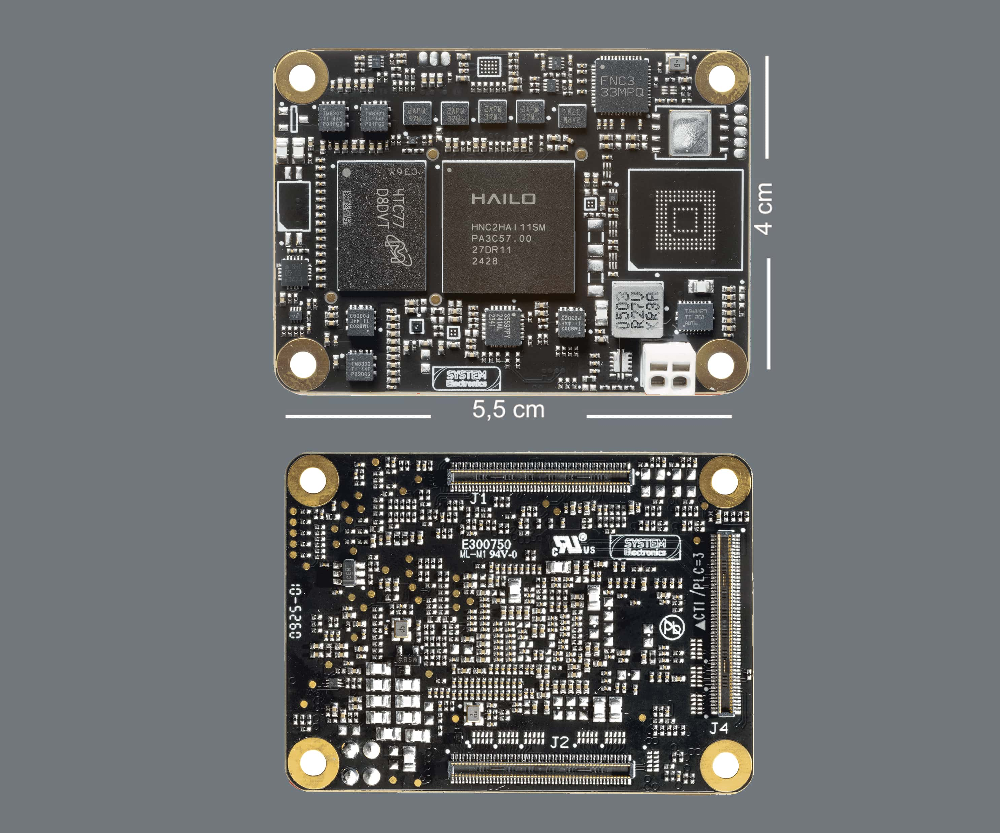
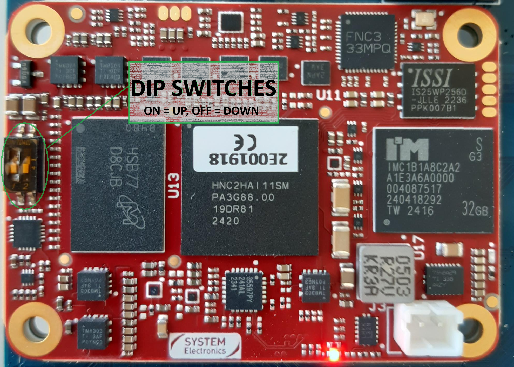
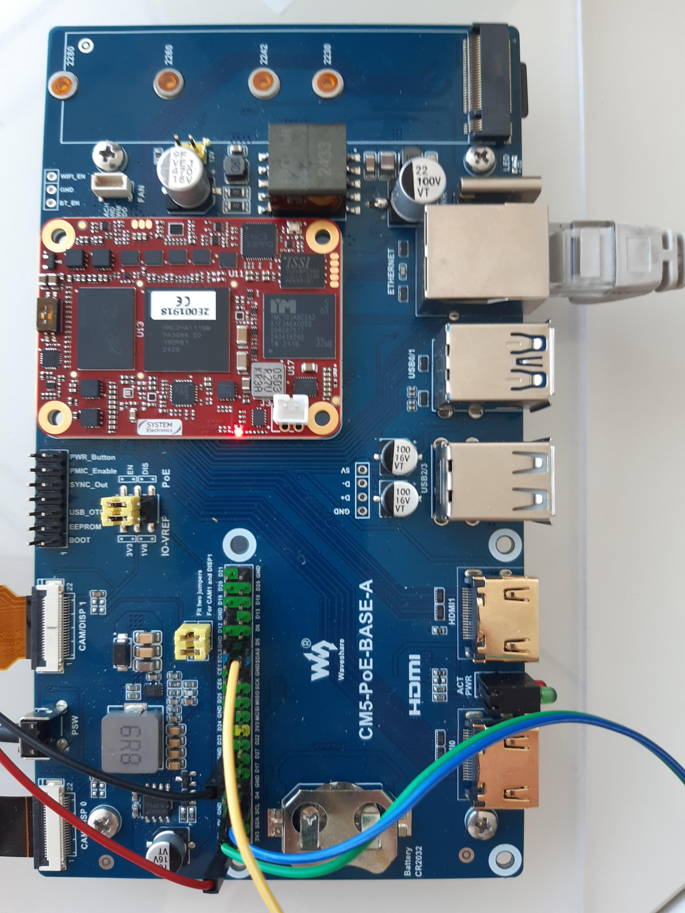

# Astrial H15 Board User Guide

## System Electronics Hailo-15 Development Platform

### Version 1.0

---

## QUICKSTART

### What You Need
- Astrial H15 board + compatible CM4/CM5 carrier board
- Ubuntu 20.04+ host computer 
- FTDI USB-to-serial cable
- Ethernet cable
- Internet connection

### Step 1: Download Release Package

Go to [releases page](https://github.com/System-Electronics-Org/meta-sysele-h15-5.15.32/releases) and download the latest `astrial-h15-yocto-build-<version>.tar.gz` file.

Extract it on your host computer:
```bash
tar -xzf astrial-h15-yocto-build-<version>.tar.gz
```

**✓ The tar.gz contains everything needed: bootloader, OS image, and all scripts**

### Step 2: Setup Tools and Environment

**Download Hailo board tools:**
Go to [Hailo Developer Zone](https://hailo.ai/developer-zone/software-downloads/) and download the Hailo Vision Processor Software Package. Extract it and copy the `hailo15_board_tools-<VERSION>.whl` file to your release folder.

```bash
python3 -m venv hailo15_env
source hailo15_env/bin/activate
pip install hailo15_board_tools-*.whl
pip install tftpy
sudo apt-get install u-boot-tools
```

Configure USB permissions:
```bash
sudo tee /etc/udev/rules.d/11-ftdi.rules > /dev/null << EOF
SUBSYSTEM=="usb", ATTR{idVendor}=="0403", ATTR{idProduct}=="6011", GROUP="plugdev", MODE="0664"
EOF
sudo udevadm control --reload-rules
```

### Step 3: Setup Hardware

**Physical connections:**
1. Mount Astrial H15 SoM on your carrier board
2. Connect FTDI cable: GND→Pin6, TX→Pin29, RX→Pin7
3. Connect Ethernet cable between host and board
4. **Do NOT power on yet**

**DIP switch configuration for programming:**
- Switch 1: **ON** 
- Switch 2: **OFF**

### Step 4: Burn Bootloader

```bash
./program_spi_flash.sh
```

Wait for "Programming completed successfully" message (~5 minutes).

**Switch DIP switches to normal boot:**
- Switch 1: **OFF**
- Switch 2: **OFF**

### Step 5: Burn SD Card

```bash
sudo dd if=meta-hailo-soc/build/tmp/deploy/images/astrial-h15core-image-hailo-dev-astrial-h15.wic of=/dev/sdX bs=4M status=progress
sync
```

**Replace `/dev/sdX` with your actual SD card device!**

### Step 6: Boot Board

1. Insert SD card into carrier board
2. Connect serial terminal: `sudo picocom --baud 115200 /dev/ttyUSB0`
3. Power on board
4. Select "Boot from SD Card" from menu (or use "Autodetect")
5. Wait for login prompt: `root@astrialh15:~#`

**Login: root/root**

### Step 7: Verify Everything Works

```bash
# Check Hailo driver
lsmod | grep hailo

# Test Hailo hardware
hailortcli scan

# Test Python/AI tools
python3 -c "import hailort; print('PyHailort OK')"

# Test network
ping 8.8.8.8
```

**🎉 Success! Your Astrial H15 is now ready for AI development.**

---

## Table of Contents

1. [Introduction](#introduction)
2. [Hardware Overview](#hardware-overview)
3. [Prerequisites](#prerequisites)
4. [Development Environment Setup](#development-environment-setup)
5. [Board Configuration](#board-configuration)
6. [Initial Board Programming](#initial-board-programming)
7. [Operating System Installation](#operating-system-installation)
8. [First Boot and Validation](#first-boot-and-validation)
9. [Troubleshooting](#troubleshooting)
10. [Support](#support)

---

## Introduction

The **Astrial H15** is a professional development board based on the Hailo-15 AI processor, customized by System Electronics for advanced edge AI applications. This guide provides step-by-step instructions to get your board operational from initial unboxing to running your first AI workloads.

### Key Features
- **Up to 20 TOPS AI processing** with Hailo-15 Vision Processor
- **Advanced camera capabilities** with integrated ISP supporting HDR, auto-focus, noise reduction
- **High-speed connectivity** including Gigabit Ethernet, USB 3.0, PCIe Gen3
- **Professional interfaces** with MIPI CSI/DSI for cameras and displays
- **Secure architecture** with hardware cryptography and secure boot
- **Yocto Linux-based OS** with Python 3.10 and AI development tools
- **Real-time, low-latency inference** optimized for edge computing
- **CM5 System on Module** form factor for industrial applications

---

## Hardware Overview

### Board Layout



### Key Components

1. **Hailo-15 Vision Processor** - Up to 20 TOPS AI processing power
2. **eMMC Storage** - 32GB onboard storage for applications and data
3. **Integrated Image Signal Processor (ISP)** - Advanced camera processing capabilities
4. **Gigabit Ethernet** - High-speed network connectivity
5. **MIPI CSI & DSI** - Camera and display interfaces
6. **USB 3.0 & PCIe Gen3** - High-bandwidth peripheral connectivity

### DIP Switch Configuration

The board features configuration DIP switches for different boot modes:



| Mode | Switch 1 | Switch 2 | Description |
|------|----------|----------|-------------|
| Normal Boot | OFF | OFF | Standard eMMC boot |
| SPI Programming | ON | OFF | Enable SPI flash programming |
| Recovery Mode | ON | ON | UART recovery mode |

---

## Prerequisites

### Hardware Requirements

- Host computer running Ubuntu 20.04 LTS or newer
- Minimum 8GB RAM, 100GB free disk space
- USB ports for serial connection
- Ethernet port or adapter
- Internet connection for package downloads

### Software Requirements

- Python 3.8 or newer
- Git version control system
- Build tools (will be installed during setup)

---

## Development Environment Setup

### Installing Hailo-15 Board Tools

1. **Download Hailo Software Package**

Download the Hailo Vision Processor Software Package from:
[https://hailo.ai/developer-zone/software-downloads/](https://hailo.ai/developer-zone/software-downloads/)

2. **Extract the Software Package**

```bash
tar -xzf hailo_vision_processor_sw_package_<version>.tar.gz
cd hailo_vision_processor_sw_package_<version>/tools
```

3. **Create Python Virtual Environment**

```bash
python3 -m virtualenv hailo15_env
source hailo15_env/bin/activate
```

4. **Install Board Tools**

```bash
pip install hailo15_board_tools-<VERSION>.whl
sudo apt-get install u-boot-tools
```

5. **Configure USB Device Rules**

```bash
sudo vim /etc/udev/rules.d/11-ftdi.rules
```

Add the following line:
```
# FT4232/FT4232H 
SUBSYSTEM=="usb", ATTR{idVendor}=="0403", ATTR{idProduct}=="6011", GROUP="plugdev", MODE="0664"
```

### Option 1: Using Prebuilt Images (Quick Start)

For rapid deployment without building from source, you can use the prebuilt images from the releases page of this repository:

**Download Prebuilt Images:**

Go to the [releases page](https://github.com/System-Electronics-Org/meta-sysele-h15-5.15.32/releases) and download the latest release artifact. The artifact is a zip file containing all the necessary files, including the `.wic` images.

**Available Images:**
- `core-image-hailo-dev-astrial-h15.wic` - Complete development image with AI tools

**Skip to [Operating System Installation](#operating-system-installation) if using prebuilt images.**

---

### Option 2: Building from Source

### Setting Up Yocto Build Environment with KAS

1. **Install KAS Build Tool**

```bash
pip3 install kas
```

2. **Clone Main Hailo Repository**

```bash
git clone -b 1.7.0 https://github.com/hailo-ai/meta-hailo-soc.git
cd meta-hailo-soc
```

3. **Clone System Electronics Customization Layer**

```bash
git clone https://github.com/System-Electronics-Org/meta-sysele-h15-5.15.32.git meta-sysele-bsp
```

4. **Secure Boot Configuration**

The Yocto build requires cryptographic keys for secure boot functionality. Create the customer keypair file:

```bash
# Navigate to the meta layer
cd meta-sysele-bsp
```

**Note**: The `customer_keypair.pem` file is intentionally not included in the repository for security reasons. 

For detailed instructions on generating and configuring secure boot keys, please refer to the **Hailo OS Secure Boot User Guide (hailo_os_secure_boot_user_guide.pdf)** available in the [Hailo Developer Zone](https://hailo.ai/developer-zone/software-downloads/).

**Warning**: Never commit private keys to version control. Keep your cryptographic keys secure and separate from your source code.

5. **Build Using KAS**

```bash
kas build meta-sysele-bsp/kas/astrial-h15.yml
```

This single command will:
- Initialize all required repositories and submodules
- Configure the build environment for Astrial H15
- Set up all necessary layers and dependencies
- Build the complete development image

### Alternative: Manual Build Environment Setup

If you prefer to set up the environment manually without KAS:

1. **Initialize Submodules**

```bash
git submodule update --init --recursive
```

2. **Initialize Build Environment**

```bash
source oe-init-build-env build-astrial-h15
```

3. **Configure Build Settings**

Edit `conf/local.conf`:
```bash
MACHINE = "astrial-h15"
DISTRO = "hailo-distro"
```

---

## Board Configuration

**Important**: The Astrial H15 is a System on Module (SoM) that requires a compatible carrier board. This guide uses the **Waveshare CM5 PoE Base-A** as reference, but the Astrial H15 is compatible with any CM4 or CM5 carrier board.

**Carrier Board Compatibility:**
- CM4 compatible carriers
- CM5 compatible carriers  
- Reference carrier: [Waveshare CM5 PoE Base-A](https://www.waveshare.com/cm5-poe-base-a.htm)

### Physical Setup

1. **Mount SoM on Carrier Board**



Mount the Astrial H15 SoM onto your carrier board following the carrier manufacturer's installation guide.

2. **Connect Serial Debug Cable (FTDI)**


Connect an FTDI USB-to-serial adapter with the following pin connections:

**FTDI to Carrier Board GPIO:**
- **GND (Black)** → **Pin 6** (Ground)
- **TX (Orange)** → **Pin 29** (GPIO5 - UART RX)  
- **RX (Yellow)** → **Pin 7** (GPIO4 - UART TX)

**Note**: Refer to your specific carrier board documentation for GPIO pinout confirmation. The pin numbers reference the standard 40-pin GPIO header layout.

**⚠️ Important GPIO Voltage Settings:**
- **MIPI/CSI Display**: When connecting displays to MIPI/CSI interfaces, the carrier board's **GPIO voltage must be set to 3.3V**

3. **Network Connection**

Connect an Ethernet cable between your host computer and the Ethernet port on your carrier board.

**For Waveshare CM5 PoE Base-A**: Use the onboard Gigabit Ethernet port or PoE functionality.

4. **Power Connection**

Connect power to your carrier board according to the carrier manufacturer's specifications.

**For Waveshare CM5 PoE Base-A**: Use either the DC power input or PoE power delivery.

### DIP Switch Configuration for Programming

Before initial programming, configure the DIP switches for SPI programming mode:


- Switch 1: **ON**
- Switch 2: **OFF**

---

## Initial Board Programming

### Programming the SPI Flash

1. **Build the Yocto Image**

Using KAS (recommended):
```bash
kas build meta-sysele-bsp/kas/astrial-h15.yml
```

Or using manual bitbake:
```bash
bitbake core-image-hailo-dev
```

2. **Execute SPI Flash Programming**

The meta layer includes a pre-configured script for SPI flash programming. From your meta layer directory:

**Note**: If using prebuilt images, copy and unzip the file directly in the script folder

```bash
cp astrial-h15-yocto-build-<version>.tar.gz meta-sysele-bsp/scripts/
cd meta-sysele-bsp/scripts/
tar -xzf astrial-h15-yocto-build-<version>.tar.gz
```

```bash
./scripts/program_spi_flash.sh
```

**Note**: this script will search the bootloader and all the other build files in the same folder or in a possible yocto build folder

**Optional**: If your serial device is not `/dev/ttyUSB0`, specify it as an argument:


```bash
./program_spi_flash.sh /dev/ttyUSB1
```


The script will automatically:
- Verify build artifacts are available
- Check serial device connectivity  
- Load UART boot firmware
- Program all required components to SPI flash
- Provide success confirmation and next steps

3. **Restore Normal Boot Configuration**

After successful programming, power down the board and restore DIP switches:


- Switch 1: **OFF**
- Switch 2: **OFF**

---

## Operating System Installation

### Setting Up TFTP Server

1. **Install TFTP Server Tools**

```bash
source hailo15_env/bin/activate
pip install tftpy
```

2. **Start TFTP Server**

#### Option A: Using Prebuilt Images

**Note**: If using prebuilt images, serve directly from the downloaded directory (unzip the release file only if you didn't it already for the "SPI Flash programming"):

```bash
cp astrial-h15-yocto-build-<version>.tar.gz meta-sysele-bsp/scripts/
cd meta-sysele-bsp/scripts/
tar -xzf astrial-h15-yocto-build-<version>.tar.gz
sudo $(which python3) ./tftp_server.py --port 69  .
```

**Note**: Be sure that the folder contains the .wic file from the zip

#### Option B: Using Built Images

The meta layer includes a pre-configured TFTP server script. From your meta layer directory:

```bash
cd meta-sysele-bsp/scripts
sudo $(which python3) ./tftp_server.py --port 69
```

**Note**: Root privileges (sudo) are required for binding to TFTP port 69.

The script will automatically:
- Detect the correct build directory path
- List available .wic files for programming
- Create symlinks for correct TFTP filename matching (`core-image-hailo-dev-astrial-h15.wic`)
- Configure network settings for board communication
- Provide clear status information

**Optional**: If your build directory is in a non-standard location, specify it manually:

```bash
sudo $(which python3) scripts/tftp_server.py --port 69 /custom/path/to/build/tmp/deploy/images/astrial-h15
```

### Programming eMMC Storage

1. **Configure Network Settings**

Set up your host computer with static IP:
- Host IP: `10.0.0.2`
- Board IP: `10.0.0.1` (automatically configured)

2. **Open Serial Terminal**

```bash
sudo picocom --baud 115200 /dev/ttyUSB0
```

**Note**: Root privileges may be required for serial port access depending on your system configuration.

3. **Power On and Access Boot Menu**

Power on the board. You should see the U-Boot boot menu:

```
*** U-Boot Boot Menu ***

   Autodetect
   Boot from SD Card
   Boot from eMMC
   Update SD (wic) from TFTP
   Update eMMC (wic) from TFTP
   Update SD (partitions) from TFTP
   Update eMMC (partitions) from TFTP
   Boot from NFS
   SWUpdate
   SWUpdate AB board init
   U-Boot console

Press UP/DOWN to move, ENTER to select, ESC/CTRL+C to quit
```

4. **Configure Boot Environment** (Optional)

The board environment is pre-configured with correct values. However, if needed, you can manually set:

```bash
setenv boot_mmc 'run bootargs_base bootargs_mmc && run load_fitimage_from_mmc && bootm ${far_ram_addr}#conf-sysele_${machine_name}.dtb${dtb_overlays}'
setenv machine_name astrial-h15
setenv core_image_name core-image-hailo-dev
setenv board astrial-h15
saveenv
```

**Note**: These values are automatically configured in the meta layer and don't typically require manual setting.

5. **Program eMMC**

**IMPORTANT**: From the U-Boot menu, select exactly **"Update eMMC (wic) from TFTP"** (option 3).

The system will:
- Download `core-image-hailo-dev-astrial-h15.wic` via TFTP
- Write the complete image (kernel + rootfs) to eMMC storage
- Return to the boot menu

**Expected TFTP output:**
```
TFTP from server 10.0.0.2; our IP address is 10.0.0.1
Filename 'core-image-hailo-dev-astrial-h15.wic'
Load address: 0x85000000
Loading: ############### (several minutes for ~2GB transfer)
Bytes transferred = 2290767872 (888a5800 hex)
Device: sdio1@78001000
Manufacturer ID: 9e
OEM: 100
Name: IM032 
Bus Speed: 52000000
Mode: MMC High Speed (52MHz)
Rd Block Len: 512
MMC version 5.1
High Capacity: Yes
Capacity: 29.1 GiB
Bus Width: 4-bit
Erase Group Size: 512 KiB
HC WP Group Size: 8 MiB
User Capacity: 29.1 GiB
Boot Capacity: 4 MiB ENH
RPMB Capacity: 4 MiB ENH
Boot area 0 is not write protected
Boot area 1 is not write protected

MMC write: dev # 1, block # 0, count 4474157 ... 
(wait several minutes for eMMC programming to complete)
4474157 blocks written: OK
```

**IMPORTANT TIMING NOTES:**
- **TFTP Download**: Takes several minutes (~2-5 minutes for 2GB+ image transfer)
- **eMMC Programming**: After download completes, wait additional 3-5 minutes for the actual writing to eMMC
- **Do NOT interrupt**: The process may appear frozen during eMMC write - this is normal
- **Total time**: Allow 10-15 minutes total for the complete process

**Note**: If you see `Filename 'fitImage'` instead of the .wic file, you selected the wrong menu option. Use `bootmenu` command to return to the menu and select option 3.

---

## First Boot and Validation

### Booting the Operating System

1. **Select eMMC Boot**

From the U-Boot menu, select "Boot from eMMC".

2. **First Boot Process**

The system will boot into the Yocto Linux environment. First boot may take several minutes.

3. **Login**

You should see the prompt: `root@astrialh15:~#`

Default credentials:
- Username: `root`
- Password: `root`

### System Validation

1. **Check System Information**

```bash
uname -a
cat /proc/cpuinfo
```

2. **Verify Hailo Driver**

```bash
lsmod | grep hailo
```

3. **Test Hailo Runtime**

```bash
hailortcli scan
```

4. **Verify Python3 and PyHailort**

```bash
python3 --version
python3 -c "import hailort; print('PyHailort available')"
python3 -c "import numpy; print('NumPy available')"
```

5. **Test Network Connectivity**

```bash
ping 8.8.8.8
```

6. **Check Storage**

```bash
df -h
```

---

## Troubleshooting

### Common Issues

#### Board Not Powering On


- Verify power adapter connection according to your carrier board specifications
- Check power LED indicators on the board
- Ensure your power supply meets the carrier board requirements

#### Serial Connection Issues

- Verify USB-to-serial driver installation
- Check device path (`/dev/ttyUSB0` or similar)
- Ensure correct baud rate (115200)
- **Troubleshooting**: If no serial output appears, try setting the carrier board's GPIO voltage to 1.8V

#### TFTP Transfer Failures

- Verify network connectivity between host and board
- Check firewall settings on host computer
- Ensure TFTP server is running with correct permissions

#### Process Appears Frozen During eMMC Programming

**Symptoms**: After TFTP download completes, the system shows `MMC write: dev # 1, block # 0, count XXXXX ...` and appears to hang.

**This is NORMAL behavior**: 
- The eMMC writing process takes 3-5 minutes and shows no progress indicators
- Do NOT power cycle or interrupt the board during this phase
- Wait patiently for the `blocks written: OK` message
- Total process time: 10-15 minutes from start to finish

#### System Shutdown Issues

**Note**: The `poweroff` command has been configured to properly power down the system. However, if you experience issues:

**Alternative shutdown methods**:
```bash
halt -p     # Force power off
shutdown -h now    # Standard shutdown
```

#### Wrong File Being Downloaded (fitImage instead of .wic)

If you see TFTP downloading `fitImage` instead of `core-image-hailo-dev-astrial-h15.wic`:

**Cause**: You selected the wrong boot menu option (likely "Boot from NFS" or "Autodetect")

**Solution**: 
1. Press Ctrl+C to interrupt the boot process
2. Run `bootmenu` command to return to the boot menu  
3. Select exactly **"Update eMMC (wic) from TFTP"** (option 3)
4. Verify the TFTP output shows the .wic filename

#### Boot Menu Not Appearing

- Verify SPI flash programming was successful
- Check DIP switch configuration
- Power cycle the board

#### SPL Boot Error (Partition Not Valid)

If you see errors like "Partition 1 not valid" or "SPL: failed to boot from all boot devices", this indicates the boot source configuration needs to be updated.

**Solution**: The meta layer has been configured with the correct boot source (`nor` instead of `mmc2`) and improved autodetect logic. Rebuild and reprogram:

```bash
bitbake core-image-hailo-dev -c cleansstate
bitbake core-image-hailo-dev
./scripts/program_spi_flash.sh
```

#### Automatic Boot Sequence

The board's autodetect feature now follows this logical sequence:
1. **eMMC Boot** - Primary boot source (when programmed)
2. **SD Card Boot** - Automatic fallback when eMMC is empty/invalid
3. **NFS Boot** - Network boot fallback
4. **Error** - If all sources fail

This ensures that boards with empty eMMC will automatically boot from SD card without manual menu selection.

### Getting Help

For technical support:

1. Check the troubleshooting section above
2. Review system logs: `dmesg` and `/var/log/messages`
3. Open an issue on the official GitHub repository with:
   - Board serial number  
   - Detailed error description
   - System logs if applicable

---

## Support

### Technical Support

**System Electronics**
- **GitHub Issues**: [https://github.com/System-Electronics-Org/meta-sysele-h15-5.15.32/issues](https://github.com/System-Electronics-Org/meta-sysele-h15-5.15.32/issues)
- **Website**: [https://www.systemelectronics.ai/en](https://www.systemelectronics.ai/en)

### Documentation Updates

This documentation is regularly updated. Check the GitHub repository for the latest version.

### Community Resources

- **Main Repository**: [https://github.com/System-Electronics-Org/meta-sysele-h15-5.15.32](https://github.com/System-Electronics-Org/meta-sysele-h15-5.15.32)
- **Prebuilt Images**: [https://github.com/System-Electronics-Org/meta-sysele-h15-5.15.32/releases](https://github.com/System-Electronics-Org/meta-sysele-h15-5.15.32/releases)

---

*Copyright © 2025 System Electronics. All rights reserved.*

*This document contains proprietary information. Reproduction or distribution without written permission is prohibited.*

